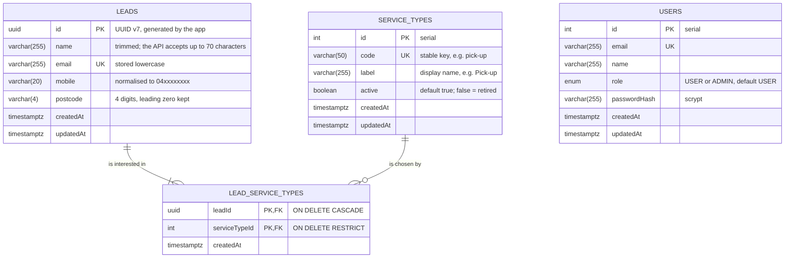
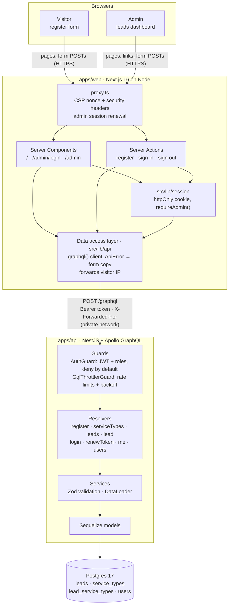
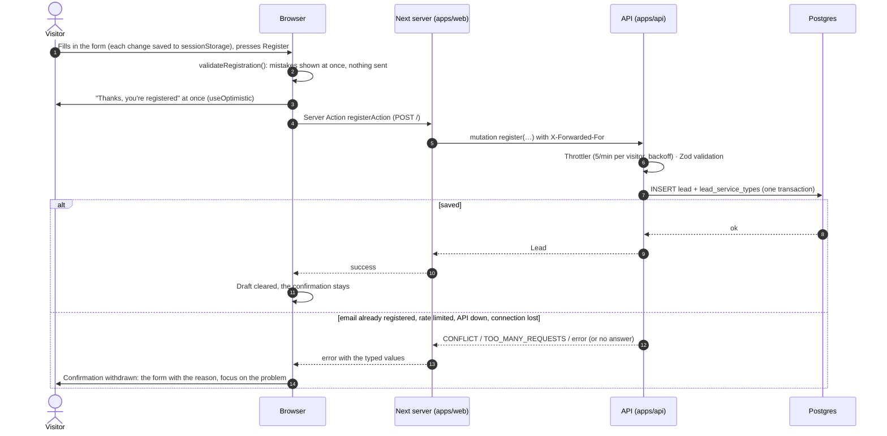
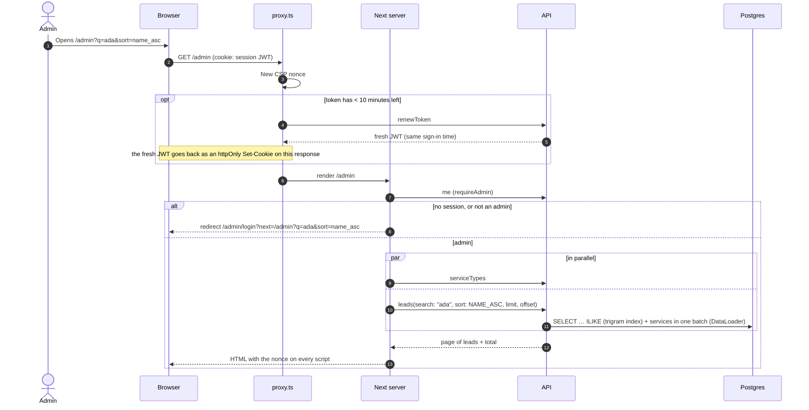

# Architecture

How Brighte Eats fits together: the database, the system, and the two main request flows. The diagrams are [Mermaid](https://mermaid.js.org), which GitHub renders in place; to edit one visually or export it for slides, paste it into [mermaid.live](https://mermaid.live) or draw.io (*Arrange → Insert → Advanced → Mermaid*).

## Database (ER diagram)

Postgres 17. The schema is owned by the migrations in `apps/api/src/database/migrations/` (see [Data modelling trade-offs](../README.md#data-modelling-trade-offs) for why it looks like this).

- **A lead has one or more services** (`||--|{`): at least one is required by the API's validation, and `register` writes the lead and its rows in one transaction. The database itself allows zero.
- **A service type can have no leads** (`||--o{`). Deleting one that leads use is refused (`RESTRICT`); retire it with `active = false` instead, so existing leads keep it. Deleting a lead deletes its rows in the join table (`CASCADE`).
- **`users` stands alone**: they're the admin (and user) accounts that sign in to the dashboard, not leads.
- `SequelizeMeta` (not shown) records which migrations have run.

**Indexes** (Mermaid can't draw them):

| Table | Index | Serves |
|---|---|---|
| `leads` | primary key `id` | `lead(id)` |
| `leads` | unique `email` | duplicate-lead check (`CONFLICT`), even under concurrent requests |
| `leads` | `(createdAt, id)` | the default newest-first order, with a stable tie-breaker for pages |
| `leads` | GIN trigram on `name`, `email` and `mobile` (`pg_trgm`) | dashboard search, which matches anywhere in the text |
| `leads` | `postcode` with `text_pattern_ops` | dashboard search's postcode prefix match; with the three above, every branch of the search's `OR` has an index |
| `lead_service_types` | primary key `(leadId, serviceTypeId)` | a lead's services; no duplicates |
| `lead_service_types` | `serviceTypeId` | filtering leads by service |
| `service_types` | unique `code` | looking types up by code |
| `users` | unique `email` | sign-in |

## System architecture

- **The browser never calls the API.** Pages and Server Actions run on the Next server and call the API through `src/lib/api`, which keeps the API address and the admin's token off the client. The session is the API's JWT in an httpOnly cookie that browser JavaScript can't read.
- **Rate limits see real visitors.** The web forwards the visitor's IP (`X-Forwarded-For`), and the API trusts one proxy hop (`TRUST_PROXY=1`), so in production the API must be reachable only from the web server.
- **Every admin page and action calls `requireAdmin()`**, which asks the API (`me`) whose token it is. `proxy.ts` only keeps an active session going (sliding: 30 minutes idle, 8 hours at most); it never decides access.
- **Validation happens twice**: in the browser for instant feedback (nothing is sent until it passes), and in the API with Zod as the source of truth.

**Repository map**

| Path | What |
|---|---|
| `apps/web/src/app` | Routes: pages, Server Actions, error and 404 pages, `robots.ts`, `sitemap.ts` |
| `apps/web/src/components` | Atomic design: `atoms` → `molecules` → `organisms` → `templates` (ESLint enforces the direction) |
| `apps/web/src/lib` | Data access (`api/`), session, URL state, validation, security headers |
| `apps/web/e2e` | Playwright end-to-end tests (mobile and desktop, with axe) |
| `apps/api/src/{auth,users,leads,common}` | Nest modules: auth and guards, accounts, leads, shared errors and rate limiting |
| `apps/api/src/database` | Migrations (Umzug), migration runner, dev seed |
| `apps/api/test` | API end-to-end tests against real Postgres, and the HTTP smoke test |
| `apps/api/bruno` | A Bruno collection of every operation |
| `packages/validation` | Registration and sign-in rules (Zod), shared by the API and the web forms |
| `scripts/bootstrap-env.mjs` | Creates the local env files for `pnpm bootstrap` |

## Request flows

### A visitor registers

- **Only the screen is fire and forget.** "Thanks" shows before the server answers, but it stays only when Postgres has committed the lead; anything else withdraws it and shows why, with what was typed. A form with mistakes never shows it.
- **A reload keeps what was typed**: the draft lives in `sessionStorage` (this tab only) until the server confirms, and is restored after hydration.
- Without JavaScript, the browser posts the form to the same Server Action and the page comes back with the result.

### An admin opens the dashboard

## Reliability: known gaps (TODO)

Registration is saved when Postgres commits, and the visitor sees "Thanks" for good only after that. A registration the server accepted is never lost. These three gaps remain, where the visitor is misled or has to act. Gap 3 matters most; they're numbered in the order to build them, since 2 and 3 both need 1.

| # | Gap | What happens today | Why it matters |
|---|---|---|---|
| 1 | **Saved, but the answer is lost**: the API commits, then the web's call times out (`TIMEOUT_MS` in `src/lib/api/client.ts`), the network drops or Next restarts | The visitor sees "We couldn't send your registration" and presses Try again; the API answers `CONFLICT`, and the form says the email "has already registered interest" | The visitor is told two wrong things in a row, and retries can never be automatic, since a retry of a saved registration fails |
| 2 | **The browser never delivers it**: the tab is closed, or the connection drops, in the second after "Thanks" shows | Lost. The draft is in `sessionStorage`, which goes when the tab closes | The visitor saw a confirmation for a registration that doesn't exist, and nobody knows |
| 3 | **The API or Postgres is briefly down** | The visitor sees "couldn't send" with their details kept, and must try again later | Registrations during an outage depend on each visitor coming back; some won't |

- [ ] **1. Make register safe to retry (idempotency key).** The browser creates a `submissionId` (UUID) for each set of values it submits, keeps it with the draft and sends the same one on every retry. The API stores it on the lead (unique `submission_id` column, one migration) and answers a repeat with the existing lead as success; `CONFLICT` still covers different submissions with the same email. The web then retries network and server errors automatically (a couple of times, short backoff) before showing "couldn't send".
- [ ] **2. Resend what the browser didn't deliver.** Keep a submission in `localStorage` (which outlives the tab) from submit until the server confirms, and send it again on the next visit. Needs 1, so a resend of a saved registration isn't a `CONFLICT`. Only helps when the visitor comes back in the same browser.
- [ ] **3. Accept registrations while the API or Postgres is down.** A second durable store the Next server can reach on its own: Postgres can't cover its own outage, and neither can the API. Kafka (or a Kafka-compatible broker such as Redpanda, or a managed queue) fits: when the API is unreachable, errors or times out, the Next server publishes the registration (`acks=all`, idempotent producer) and answers success; an API consumer writes it to Postgres once it's back (at-least-once; commit the offset after the database commit; a replay that hits `CONFLICT` is done; validation failures go to a dead-letter topic). Decisions to make first: queue only as a fallback (keeps duplicate-email, rate-limit and field feedback) or every registration (one path, but that feedback moves or disappears); which broker; rate limiting on the queued path. Needs 1, so a registration that was saved before the timeout isn't queued twice.

For side effects of a registration later (confirmation email, CRM sync), use a transactional outbox rather than publishing from the API: an `outbox` row written in the lead's transaction, processed by a worker with retries. It can feed Kafka too.
