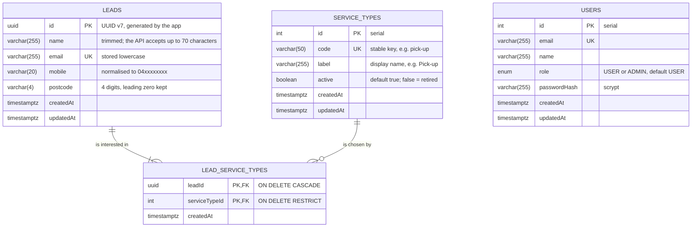
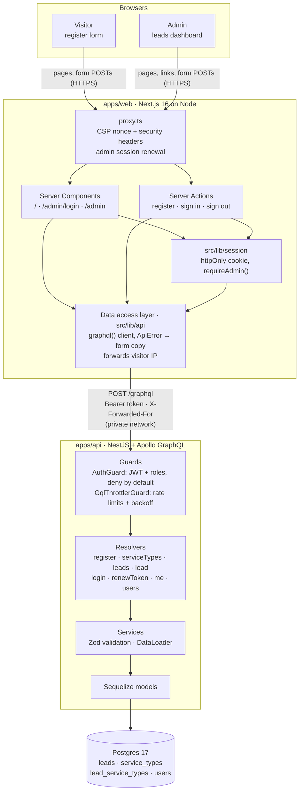
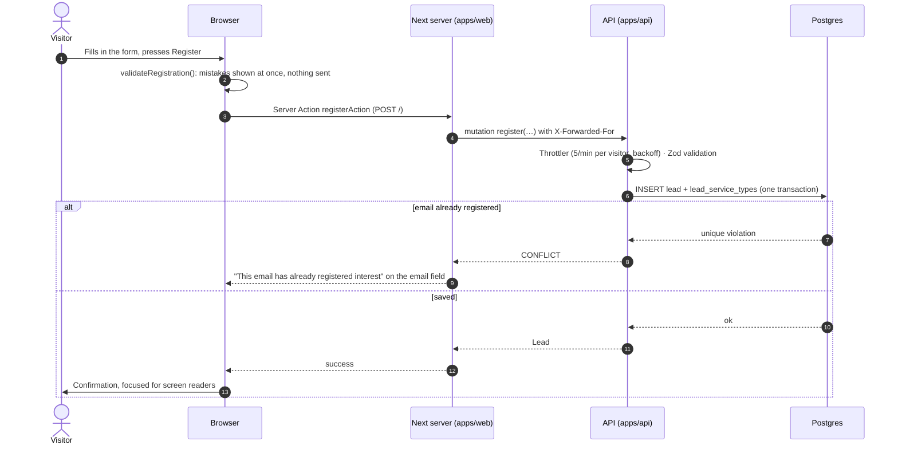
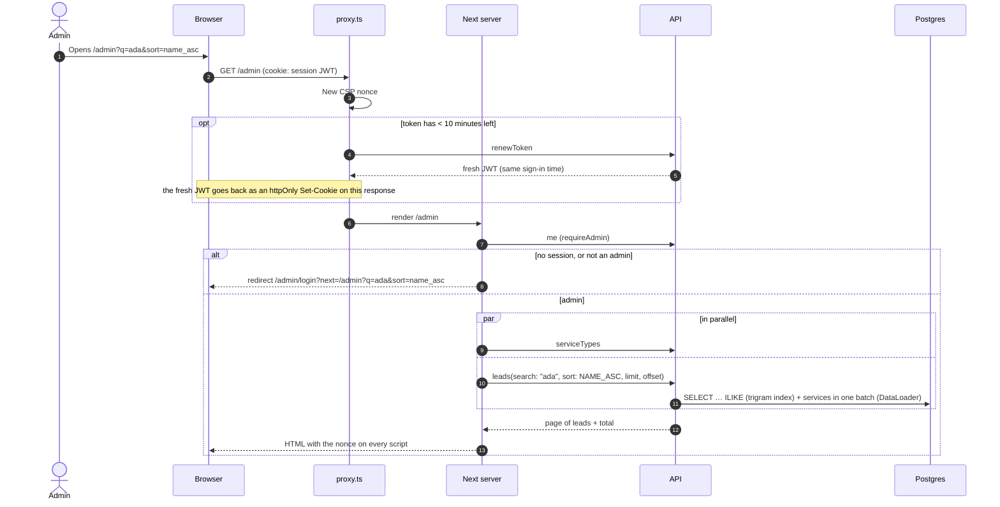

# Architecture

How Brighte Eats fits together: the database, the system, and the two main request flows. The diagrams are [Mermaid](https://mermaid.js.org), which GitHub renders in place; to edit one visually or export it for slides, paste it into [mermaid.live](https://mermaid.live) or draw.io (*Arrange → Insert → Advanced → Mermaid*).

## Database (ER diagram)

Postgres 17. The schema is owned by the migrations in `apps/api/src/database/migrations/` (see [Data modelling trade-offs](../README.md#data-modelling-trade-offs) for why it looks like this).

- **A lead has one or more services** (`||--|{`): at least one is required by the API's validation, and `register` writes the lead and its rows in one transaction. The database itself allows zero.
- **A service type can have no leads** (`||--o{`). Deleting one that leads use is refused (`RESTRICT`); retire it with `active = false` instead, so existing leads keep it. Deleting a lead deletes its rows in the join table (`CASCADE`).
- **`users` stands alone**: they're the admin (and user) accounts that sign in to the dashboard, not leads.
- `SequelizeMeta` (not shown) records which migrations have run.

**Indexes** (Mermaid can't draw them):

| Table | Index | Serves |
|---|---|---|
| `leads` | primary key `id` | `lead(id)` |
| `leads` | unique `email` | duplicate-lead check (`CONFLICT`), even under concurrent requests |
| `leads` | `(createdAt, id)` | the default newest-first order, with a stable tie-breaker for pages |
| `leads` | GIN trigram on `name`, and on `email` (`pg_trgm`) | dashboard search, which matches anywhere in the text |
| `lead_service_types` | primary key `(leadId, serviceTypeId)` | a lead's services; no duplicates |
| `lead_service_types` | `serviceTypeId` | filtering leads by service |
| `service_types` | unique `code` | looking types up by code |
| `users` | unique `email` | sign-in |

## System architecture

- **The browser never calls the API.** Pages and Server Actions run on the Next server and call the API through `src/lib/api`, which keeps the API address and the admin's token off the client. The session is the API's JWT in an httpOnly cookie that browser JavaScript can't read.
- **Rate limits see real visitors.** The web forwards the visitor's IP (`X-Forwarded-For`), and the API trusts one proxy hop (`TRUST_PROXY=1`), so in production the API must be reachable only from the web server.
- **Every admin page and action calls `requireAdmin()`**, which asks the API (`me`) whose token it is. `proxy.ts` only keeps an active session going (sliding: 30 minutes idle, 8 hours at most); it never decides access.
- **Validation happens twice**: in the browser for instant feedback (nothing is sent until it passes), and in the API with Zod as the source of truth.

**Repository map**

| Path | What |
|---|---|
| `apps/web/src/app` | Routes: pages, Server Actions, error and 404 pages, `robots.ts`, `sitemap.ts` |
| `apps/web/src/components` | Atomic design: `atoms` → `molecules` → `organisms` → `templates` (ESLint enforces the direction) |
| `apps/web/src/lib` | Data access (`api/`), session, URL state, validation, security headers |
| `apps/web/e2e` | Playwright end-to-end tests (mobile and desktop, with axe) |
| `apps/api/src/{auth,users,leads,common}` | Nest modules: auth and guards, accounts, leads, shared errors and rate limiting |
| `apps/api/src/database` | Migrations (Umzug), migration runner, dev seed |
| `apps/api/test` | API end-to-end tests against real Postgres, and the HTTP smoke test |
| `apps/api/bruno` | A Bruno collection of every operation |
| `packages/validation` | Registration and sign-in rules (Zod), shared by the API and the web forms |
| `scripts/bootstrap-env.mjs` | Creates the local env files for `pnpm bootstrap` |

## Request flows

### A visitor registers

### An admin opens the dashboard

